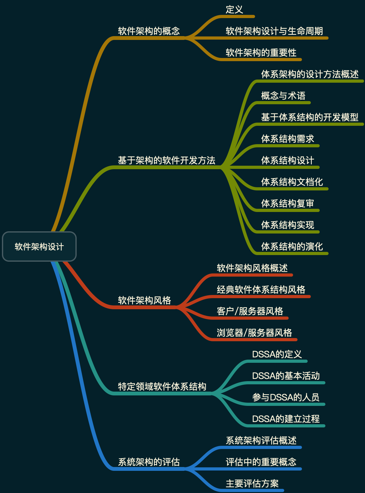
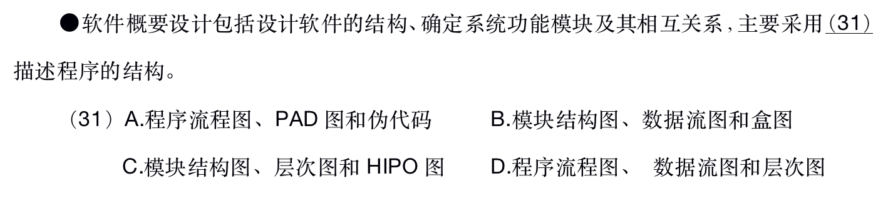
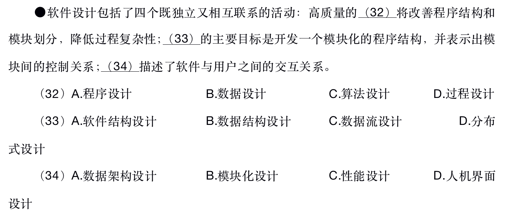

# 软件架构设计

## 知识点

## 软件设计

软件设计分为概要设计和详细设计两个阶段。

### 概要设计

也称为高层设计或总体设计，即将软件需求转化为数据结构和软件的系统结构。

概要设计包括：

* 设计软件的结构
* 确定系统由哪些模块组成
* 每个模块之间的关系

可以用以下工具来描述程序的结构：

* 结构图（包括模块，调用和数据）
* 层次图
* HIPO（层次图加输入/处理/输出图）

### 设计活动

软件设计包括4个活动：

1. 数据设计
2. 软件结构设计
3. 人机界面设计
4. 过程设计

#### 数据设计

由于数据结构对程序结构和过程复杂性都有影响，因此数据结构对软件质量的影响是很深远的。好的数据设计将改善程序结构和模块划分，降低过程复杂性。数据设计将分析时创建的信息域模型变换成实现软件所需要的数据结构。在E-R图中定义的数据对象和关系，以及数据字典中描述的详细数据内容为数据设计活动奠定了基础。

#### 软件结构设计

软件结构设计的主要目标是开发一个模块化的程序结构，并表示出模块间的控制关系。此外，软件结构设计将程序结构和数据结构相结合，为数据在程序中的流动定义的接口。

#### 人机界面设计

人机界面设计（接口设计）描述了软件内部，软件和协作系统之间，以及软件与人（用户）之间如何通信。一个接口意味着信息流（如数据和/或控制流），因此，数据和控制流图提供了人机界面设计所需的信息。

#### 过程设计

过程设计应该在数据设计，架构设计和接口设计完成之后进行。所有的程序都可以建立在一组已有的逻辑构成元素上，这一组逻辑构成元素强调了“”对功能域的维护“”，其中每一个逻辑构成元素有可预测的逻辑结构，即从顶端进入，从底端退出，读者可以很容易地理解过程流。

## 题目
### 1. 2018下半年架构师

答案： C

解析：概要设计阶段使用：结构图，层次图和HIPO图也描述程序的结构。

答案： B，A，D

解析：软件设计的4个活动：数据设计，软件结构设计，人机界面设计，过程设计。数据设计（数据结构）将改善程序结构和模块划分，降低过程复杂性。软件结构设计的主要目标是开发一个模块化的程序结构，并表示出模块间的控制关系。人机界面描述了软件也用户之间的交互关系。
