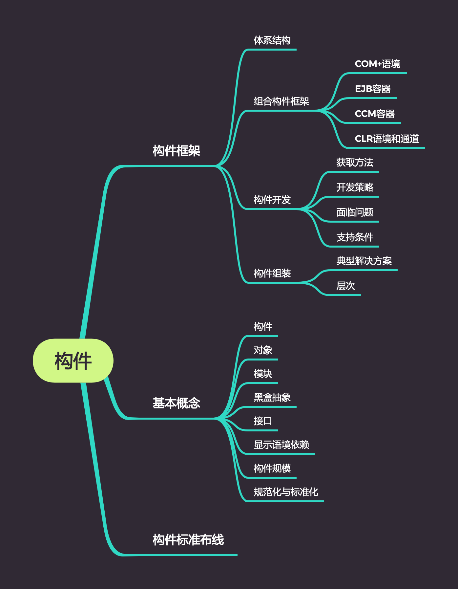

# 面向构件的软件设计

## 知识点

## 构件

构件是可以实现特定的功能，符合一套接口标准并实现一组接口，在系统中病存在的可更换部分。

### 基本概念

1. 模块: 本身可以作为一个最简单的构件。
2. 构件的规模: 在“最大化重用”和语境依赖爆炸性增长之间，找到平衡点，在体系中很好地运行。
3. 接口：一个已命名和一组操作的集合。
4. 白盒抽象：实现细节对外界完成可见。
5. 黑盒抽象：客户对接口和规约之外的实现细节一无所知。
6. 白盒重用：依赖于对具体实现细节的理解，通过接口来使用软件部件。
7. 黑盒重用：仅仅依赖于接口和规约来实现，适用于应用程序接口完全与内部的具体实现无关。
8. 显示语境依赖：为了使构件正常地工作，必须说明其对部署环境的具体要求。

### 构件和对象

构件特征：独立部署单元，作为第三方的组装单元，没有（外部的）可见状态。

对象特征：一个实例单元，具有唯一的标志，可能具有状态，此状态外部可见，封装了自己的状态和行为。

## 构件布线标准

1. 接口和对象引用规范
2. 接口关系和多态性
3. 命名和定位服务
4. 复合文档

## 构件框架

### 体系结构

1. 构件和外部环境的交互
2. 构件的角色
3. 对最终用户和部署人员的用户界面
4. 标准化工具的界面

### 语境相关的构建框架

1. COM+语境：由Microsoft制定，增加了可租赁线程“套间”的概念，一次只允许一个线程入住，但是多个线程能顺序地入住该“套间”。
2. EJB容器：由SUM的Java企业Bean制定，运行类进行明确的事物控制。
3. CCM容器：由OMG制定，在EJB的会话构件和实体构件之外增加了对过程构件的支持。
4. CLR语境和通道：为语境相关组装提供真正的可扩展设施和主流结构。

### 开发方法

1. 从现有构件中获得符合要求的构件，直接使用或作适用性修改，得到可复用的构件。
2. 通过遗留工程，将具有潜在利用价值的软件提取出来，得到可利用的构件。
3. 从市场上购买现成的商业构件。
4. 开发新的符合要求的构件。

### 开发策略

1. 分区：指的是将问题情景的空间分割成几乎可以独立研究的部分。
2. 抽象：是对在给定实践内执行指定计算的软/硬件单元的一种抽象。
3. 分割：是将结构引入构件的行为，支持对行为性质的时序推理。