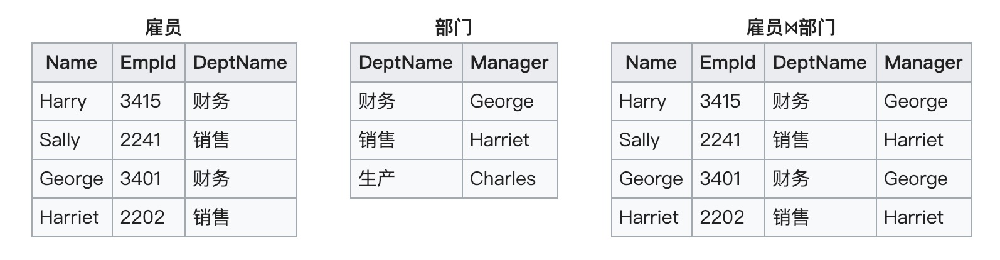
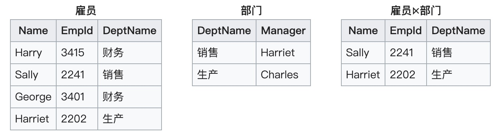
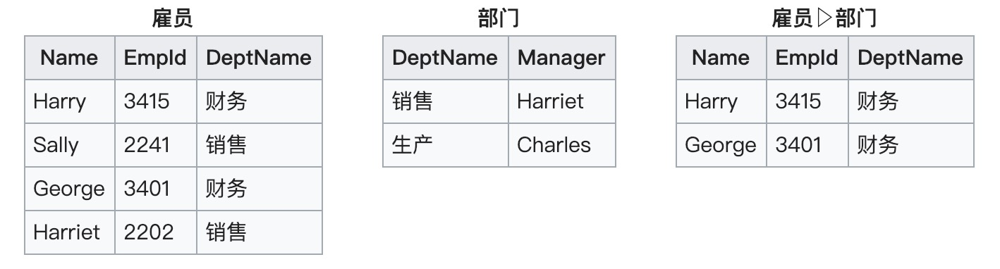
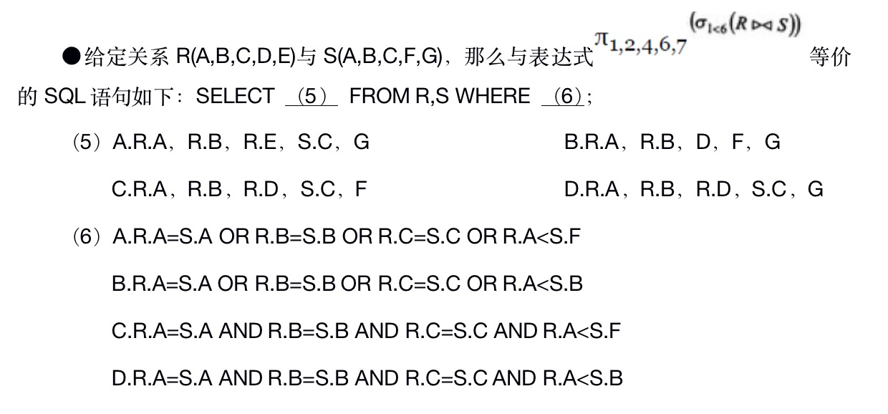
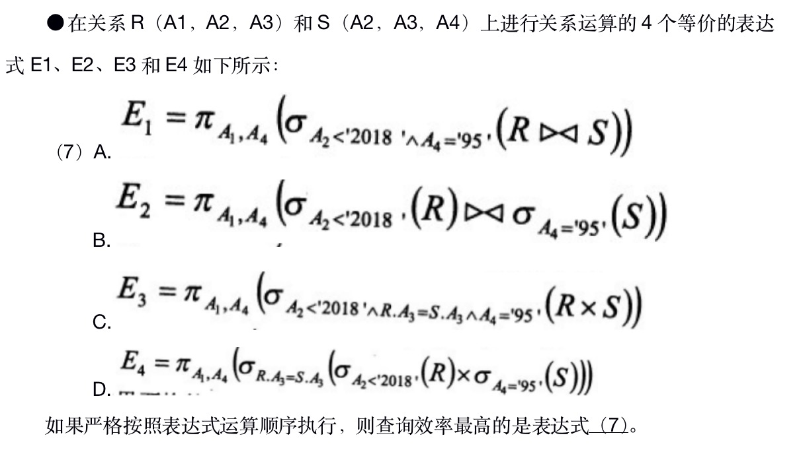

# 数据库关系代数

## 原始运算

E.F.Cood的六个原始运算是“选择”，“投影”，“笛卡尔积”，“并集”，“差集”，“重命名”。

“交集”可以由“差集”来定义。“并集”，“交集”和“差集”运算的两个关系必须有同样的属性集合。

### 投影（𝝅）
一元运算。表示从整个属性集合中选取一部分属性。

### 选择 (𝝈)
一元运算。通过“与”，“或”，“非”构成命题公式。从集合中选取符合条件的部分元组。

### 重命名 (𝝆)
一元运算。用于重命名元组中的字段。

## 连接运算
### 自然连接 （⋈）
自然连接是写为（R ⋈ S）的二元运算。自然连接的结果是在Ｒ和Ｓ中在它们的公共属性名称上相等的所有元组的集合。例如下面是表格“雇员”和“部门”和它们的自然连接。

### 半连接 （⋉⋊）
半连接是类似于自然连接的写为R ⋉ S的连接，这里的R和S是关系。半连接的结果只是在S中有在公共属性名字上相等的元组所有的R中的元组。例如下面的例子是“雇员”和“部门”和它们的半连接的图。

### 反连接 （▷）
反连接是类似于自然连接的写为R ▷ S的连接，这里的R和S是关系。反连接的结果是在S中没有在公共属性名字上相等的元组的R中的那些元组。 例如“雇员”和“部门”和它们的反连接。

## 题目

### 1. 2018下半年架构师

答案：B  C
解析：表达式的前半部分表示投影，意思是选取序号为：1，2，4，6，7的字段，分别对应关系中的：A，B，D，F，G，所以第一题的选：B。表达式的后半部分表示关系R和S的自然连接(⋈)，所以条件为两个集合中公共属性相同，并且提供了选择(𝝈)条件, 条件为 1<6，即 A<F，所以答案为：C。

答案：D
解析：选择运算拆分比合并在一起的要效率高。笛卡尔积比自然选择效率更高。（有待验证）