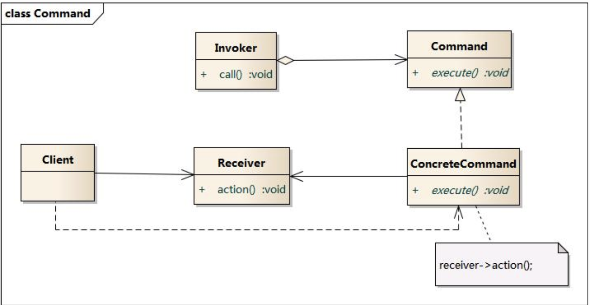

# 行为模式

## 命令模式

命令模式（Command Pattern）将一个请求封装为一个对象，从而使我们可用不同的请求对客户进行参数化; 对请求排队或记录请求日志，以及支持可撤销的操作。也就动作（Action）模式或事务（Transaction）模式。包含如下角色：

1. Command 抽象命令类
2. ConcreteCommand 具体命令类
3. Invoker 调用者
4. Receiver 接收者
5. Client 客户类



### 示例

```java
import java.util.List;
import java.util.ArrayList;

public interface Command {
  void execute();
}

// Invoker
public class Switch {
  private final List<Command> history = new ArrayList<>();

  public Switch() {}

  public void storeAndExecute(Command cmd) {
    history.add(cmd);
    cmd.execute();
  }
}

// Receiver
public class Light {
  public void turnOn() {
    System.out.println("turn on");
  }

  public void turnOff() {
    System.out.println("turn off");
  }
}

// ConcreteCommand
public class FlipOnCommand {
  private final Light light;

  public FlipOnCommand(Light light) {
    this.light = light;
  }

  @Overrider
  public void execute() {
    this.light.turnOn();
  }
}

// ConcreteCommand
public class FlipOffCommand {
  private final Light ligth;

  public FlipOffCommand(Light light) {
    this.light = light;
  }

  @Overrider
  public void execute() {
    this.light.turnOff();
  }
}

// Client
public class Client {
  public static void main(String[] args) {
    Light light = new Light();
    Command flipOn = new FlipOnCommand(light);
    Command flipOff = new FlipOffCommand(light);

    Switch sw = new Switch();
    sw.stroeAndExecute(flipOn);
    sw.stroeAndExecute(flipOff);
  }
}
```

### 优缺点

优点

- 降低系统的耦合度
- 新的命令可以很容易地加入到系统中。
- 可以比较容易地设计一个命令队列和宏命令（组合命令）。
- 可以方便地实现对请求的 Undo 和 Redo。

缺点

- 使用命令模式可以会导致某些系统有过多的具体命令类。因为针对每一个命令都需要设计一个具体命令类，因此某些系统可能需要大量具体命令类，这将影响命令模式的使用。

### 适用情况

需要将请求调用者和请求接收者解耦，使得调用者和接收者不直接交互。需要在不同的时间指定请求，将请求排队和执行请求。需要支持命令的撤销操作和恢复操作，需要将一组操作组合在一起，即支持宏命令。
