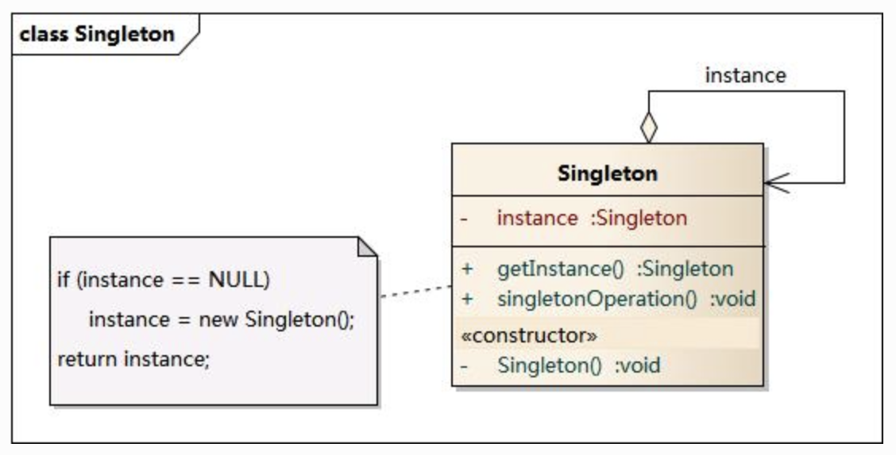

# 创建型模式

创建型模式主要包括：简单工厂，工厂方法，抽象工厂，建造者，原型，单例

## 简单工厂(Simple Factory Pattern)或静态工厂模式

工厂类根据输入的不同参数来创建不同的具体类。工厂类提供静态创建类的方法。该模式主要包含三个角色：

1. Factory 工厂角色，负责实现创建所有实例的内部逻辑。
2. Product 抽象产品角色，是所创建的所有具体类的父类。
3. ConcreteProduct 具体产品角色。


```java
public class ImageReaderFactory {
  public static ImageReader imageReaderFactoryMethod(InputStream is) {
    ImageReader product = null;
    int imageType = determineImageType(is);
    switch(imageType) {
      case ImageReaderFactory.GIF:
        product = new GifReader(is);
      case ImageReaderFactory.JPEG:
        product = new JpegReader(is);
      // ...
    }
    return product;
  }
}
```

### 要点

当你需要什么，只需要传入正确的参数，就可以获取你需要的对象，无须知道其创建细节。

### 优缺点

实现对象的创建和使用相分离，将对象的创建交给专门的工厂负责。缺点时工厂类不够灵活，增加新的具体类需要修改工厂类的实现逻辑，而且具体产品多时，实现会比较复杂。

## 工厂方法(Factory Method Pattern)

工厂方法模式也叫多态工厂模式。该模式不再设计一个工厂来统一负责所有产品的创建，而是将具体的创建过程交给专门的工厂子类去完成。这样可以将产品类的实例化操作延迟到工厂子类中完成。包含 4 个角色：

1. Product 抽象产品
2. ConcreteProduct 具体产品
3. Factory 抽象工厂
4. ConcreteFactory 具体工厂


### 示例代码

```java
// Products
public calss Button {}
public class WinButton extends Button {}
public class MacButton extends Button {}

// Factory
public interface ButtonFactory {
  Button createButton();
}
public class WinButtonFactory implements ButtonFactory {
  public Button createButton() {
    return new BinButton();
  }
}
public class MacButtonFactory implements ButtonFactory {
  public Button createButton() {
    return new MacButton();
  }
}
```

工厂方法模式是简单工厂模式的进一步的抽象和推广。核心的工厂类不再负责所有产品的创建，它仅仅负责给出具体工厂必须实现的接口，而不负责哪一个产品类被实例化这种细节，这使得工厂方法模式可以允许系统在不修改工厂角色的情况下引进新产口。

### 实例


### 优缺点

优点是增加新的产品类无须修改现有系统，并封装了产品对象的创建细节，系统具有良好的灵活性和可扩展性。

缺点在于增加新产品的同时需要增加新的工厂，导致系统类的个数成对增加，在一定程序上增加了系统的复杂性。

## 抽象工厂模式(Abstract Factory Pattern)

抽象工厂模式提供一个创建一系列相关或相互依赖对象的接口，而无须指定它们具体的类。抽象工厂模式又称为 Kit 模式。

在工厂模式中一个具体工厂对应一种具体的产品，具有唯一性。而抽象工厂模式中一个具体工厂可以对应多种具体的产品(产品族）。具体角色：

1. AbstractFactory 抽象工厂
2. ConcreteFactory 具体工厂
3. AbstractProduct 抽象产品
4. ConcreteProduct 具体产品


### 示例

```java
// Products
public interface Button {}
public interface Border {}

public class MacButton implements Button {}
public class WinButton implements Button {}
public class MacBorder implements Border {}
public class WinBorder implements Border {}

// Factory
public interface GUIFactory {
  Button createButton();
  Border createBorder();
}

public class WinFactory implements GUIFactory {
  public Button createButton() {
    return new WinButton();
  }
  public Border createBorder() {
    return new WinBorder();
  }
}

public class MacFactory implements GUIFactory {
  public Button createButton() {
    return new MacButton();
  }
  public Border createBorder() {
    return new MacBorder();
  }
}
```

### 优缺点

主要优点是隔离了具体类的生成，使得客户并不需要知道什么被创建，而且每次可以通过具体工厂类创建一个产品族中的多个对象，增加或者替换产品族比较方便，增加新的具体工厂和产品族很方便。

缺点是在于增加新的产品等级结构很复杂，需要修改抽象工厂和所有的具体工厂类，对“”开闭原则“”的支持呈现倾斜性。

### 适用情况

一个系统不应当依赖于产品类实例如何被创建、组合和表达的细节。系统中有多于一个的产品族而每次只使用其中某一产品族。属于同一个产品族的产品将在一起使用，系统提供一个产品类的库，所有的产品以同样的接口出现，从而使用客户端不依赖于具体实现。

## 建造者模型(Builder Pattern)

将一个复杂的构建与它的表示分离，使得同样的构建过程可以创建不同的表示。建造者模式是一步一步创建一个复杂的对象，它允许用户只通过指定复杂对象的类型和内容就可以构建它们，用户不需要知道侧部的具体构建细节。包含的角色如下：

1. Builder 抽象建造者
2. ConcreteBuilder 具体建造者
3. Director 指挥者
4. Product 产品角色


### 优缺点

客户端不必知道产品内部组成的细节，将产品本身与产品的创建过程解耦，使得相同的创建过程可以创建不同的产品对象。

建造者模式所创始地的产品一般具有较多的共同点，其组成部分相似，如果产品之间的差异性很大，则不适合。

### 适用情况

需要生成的产品对象有复杂的内部结构，这些产品对象通常包含多个成员属性，需要生成的产品对象的属性相互依赖，需要指定其生成顺序。对象的创建过程独立于创建该对象的类。隔离复杂对象的创建和使用，并使得相同的创建过程可以创建不同类型的产品。

## 单例模式(Singleton Pattern)

单例模式确保某一个类只有一个实例，而且自行实例化并向整个系统提供这个实例。有三个要点：

1. 只能有一个实例。
2. 必须自行创建这个实例。
3. 必须自行向整个系统提供这个实例。



典型实现：

1. 单例类的构造函数为私有
2. 提供一个自身的静态私有成员变量
3. 提供一个公有的静态工厂方法

### 优缺点

优点是提供了对唯一实例的受控访问并可以节约系统资源。
缺点在于因为缺少抽象层而难以扩展，且单例类职责过重。
