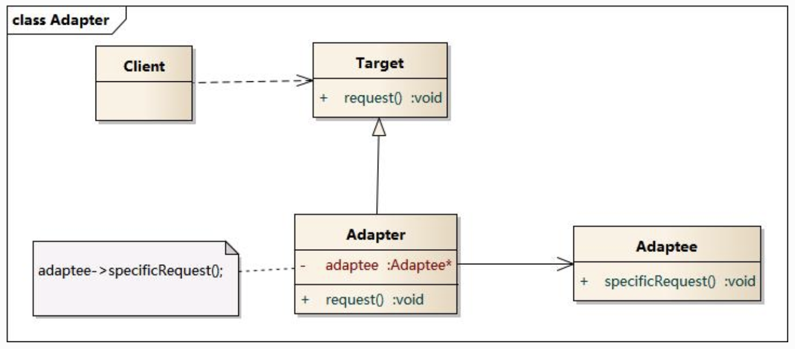

# 结构型模式

结构型模式描述如何将类和对象结合在一起形成更大的结构，就像搭积木，可以通过简单积木的组合形成复杂的、功能更为强大的结构。

结构型模式分为:

1. 类结构型模式, 关于多个类的组合。
2. 对象结构型模式，类与对象的组合。

包括的模式有：适配器模式，桥接模式，组合模式，装饰模式，外观模式，享元模式，代理模式。

## 适配器模型(Adapter Pattern)

适配器模式将一个接口转换成客户希望的另一个接口，适配器模式使接口不兼容的那些类可以一起工作，其别名为包装器(Wrapper)。适配器模式既可以作为类结构型模式，也可以作为对象结构型模式。包含如下角色。

1. Target 目标抽象类
2. Adapter 适配器类
3. Adaptee 适配者类
4. Client 客户类

对象适配器



类适配器


### 优缺点

优点

1. 将目标类与适配者类解耦，通过引入一个适配器类来重用现有适配都类，而无须修改原有代码。
2. 增加了类的透明性和复用性，将具体的实现封装在适配者类中，对于客户端来说是透明的，而且提高了适配者的复用性。
3. 灵活性和扩展性都非常好，通过使用配置文件，可以很方便地更换适配器，也可以在不修改原有代码的基础上增加新的适配器类，完全符合“开闭原则”。

缺点

类适配器模式需要使用多个继承的概念，但一般的现代面向对象语言没有这种机制，如：Java，C#.

对象适配器与类适配器模式相比，要想转换适配者类的方法就不容易。

### 适用性

1. 系统需要使用现有的类，而这些类的接口不符合系统的需要。
2. 想要建立一个可以重复使用的类，用于与一些彼此之间没有太大关联的一些类，包括一些可能将来引进的类一起工作。

## 桥接模式(Bridge Pattern)

将抽象部分与它的实现部分分离，使它们都可以独立地变化。又称为接口模式。桥接模式包含的角色如下：

1. Abstraction 抽象类
2. RefinedAbstraction 扩充抽象类
3. Implementor 实现类接口
4. ConcreteImplementor 具体实现类


在桥接模式中，抽象化与实现化脱耦，它们可以沿着各自的维度独立变化。

### 示例

```java
// Implementor
interface DrawingApi {
  void drawCircle(double x, double y, double radius);
}

// ConcreteImplementor 1
class DrawimgApi1 implements DrawingApi {
  public void drawCircle(double x, double y, double radius) {
    System.out.printf("api1 x:%f, y:%f, radius: $f\n", x, y, radius);
  }
}

// ConcreteImplementor 2
class DrawimgApi2 implements DrawingApi {
  public void drawCircle(double x, double y, double radius) {
    System.out.printf("api2 x:%f, y:%f, radius: $f\n", x, y, radius);
  }
}

// Abstraction
interface Shape {
  void draw();
  void resizeByPercent(double percent);
}

// RefinedAbstraction
class CircleShape implements Shape {
  private double x, y, radius;
  private DrawingApi drawingApi;

  public CircleShape(double x, double y, double radius, DrawingApi drawingApi) {
    this.x = x;
    this.y = y;
    this.radius = radius;
    this.drawingApi = drawingApi;
  }

  @Override
  public void draw() {
    this.drawingApi.draw();
  }

  @Override
  public void resizeByPercent(double percent) {
    radius *= percent;
  }
}

// Client
class BridgePattern {
  public static void Main(String[] args) {
    Shape[] shapes = new Shape[2];
    shapes[0] = new CircleShape(1, 2, 3, new DrawingApi1);
    shapes[1] = new CircleShape(4, 5, 6, new DrawingApi2);

    for (Shape shape : shapes) {
      shape.resizeByPercent(1.5);
      shape.draw();
    }
  }
}
```

### 优缺点

主要优点分离抽象接口及其实现部分，是比多继承方案更好的解决方法，桥接模式还提高了系统的可扩充性，在两个变化维度中任意扩展一个维度，都不需要修改原有系统，实现细节对客户透明，可以对用户隐藏实现细节。

主要缺点是增加系统的理解与设计难度，且识别出系统中两个独立变化的维度并不是一件容易的事情。

### 适用性

需要在构件的抽象化角色和具体化角色之间增加更多的灵活性，避免在两个层次之间建立静态的继承关系。抽象化角色和实现化角色可以以继承的方式独立扩展而互不影响。一个类存在两个独立变化的维度，且这两个维度都需要进行扩展。设计要求需要独立管理抽象化角色和具体化角色。不希望使用继承或因为多层次继承导致系统类的个数急剧增加的系统。

## 装饰模式(Decorator Pattern)

装饰模式动态地给一个对象增加一些额外的职责，就增加对象功能来说，装饰模式比生成子类实现更为灵活。其另外也可以称为包装器（Wrapper），与适配器模式的别名相同，但它们适用于不同的场合。装饰模式包含的角色如下:

1. Component 抽象构件
2. ConcreteComponent 具体构件
3. Decorator 抽象装饰类
4. ConcreteDecorator  具体装饰类


### 示例

```java
// 1. Component
public interface Window {
  public void draw();
  public String getDesc();
}

// 2. ConcreteComponent
public class SimpleWindow implements Window {
  public void draw() {}
  public String getDesc() {
    return "simple window";
  }
}

// 3. Decorator
public abstract class WindowDecorator implements Window {
  protected Window decoratedWindow;
  public WindowDecorator(Window window) {
    this.decoratedWindow = window;
  }

  @Override
  public void draw() {
    this.decoratedWindow.draw();
  }

  @Override
  public String getDesc() {
    return this.decoratedWidnow.getDesc();
  }
}

// 4. ConcreteDecorator 1
public class VerticalScrollBar extends WindowDecorator {
  public VerticalScrollBar(Window window) {
    super(window);
  }

  @Override
  public void draw() {
    super.draw();
    drawVeritcalScroolBar();
  }

  @Override
  public String getDesc() {
    return super.getDesc() + ", including vertical scroll bar";
  }

  private void drawVeritcalScrollBar() {
  }
}

// 4. ConcreteDecorator 2
public class HorizontalScrollBar extends WindowDecorator {
  public HorizontalScrollBar(Window window) {
    super(window);
  }

  @Override
  public void draw() {
    super.draw();
    drawHorizontalScrollBar();
  }

  @Override
  public String getDesc() {
    return super.getDesc() + ", including vertical scroll bar";
  }

  private void drawHorizontalScrollBar() {
  }
}
```

### 优缺点

优点是可以提供比继承更多的灵活性，可以通过一种动态的方式来扩展一个对象的功能，并通过使用不同的具体装饰类以及这些装饰类的排列组合，可以创造很多不同的行为的组合，而且具体构件类与具体装饰类可以独立变化，用户可以根据需要增加的的具体构件类和具体装饰类。

缺点在于使用装饰模式进行系统设计时将产生很多小对象，而且装饰模式经继承更加易于出错，排错也很困难，对于多次装饰的对象，高度地寻找错误可能需要逐级排查，较为烦琐。

### 适用情况

在不影响其他对象的情况下，以动态、透明的方式给单个对象添加职责。需要动态地给一个对象增加功能，这些功能也可以动态的被撤销。当不能采用继承的方式对系统进行扩充或采用继承不利于系统扩展和维护时。

## 外观模式(Facade Pattern)

外部与一个子系统的通信必须通过一个统一的外观对象进行，为子系统中的一组接口提供一个一致界面，外观模式定义了一个高层接口，这个接口使得这一子系统更加容易使用。包括角色如下：

1. Facade 外观角色
2. SubSystem 子系统角色


### 示例

```java
// Complex parts
class CPU {
  public void freeze() {}
  public void jump(long position) {}
  public void execute() {}
}

class Memory {
  public void load(long position, byte[] data) {}
}

class HardDrive {
  public byte[] read(long lba, int size) {}
}

// Facade
class Computer {
  public void startComputer() {
    cpu.freeze();
    memory.load(BOOT_ADDR, heaDrive.read(BOOT_SECTOR, SECTOR_SIZE));
    cpu.jump(BOOT_ADDRESS);
    cpu.execute();
  }
}

// Client
class Client {
  public static void main(String[] args) {
    Computer facade = new Computer();
    facade.startComputer();
  }
}
```

### 优缺点

优点：

* 对客户屏蔽子系统组件，减少了客户处理的对象数目并使用得子系统使用起来更加容易。
* 实现了子系统与客户之间的松耦合关系。
* 只是提供了一个访问子系统的统一入口，并不影响用户直接使用子系统类。

缺点

* 不能很好地限制客户使用子系统类，如果对客户访问子系统类做太多的限制则减少了可变性和灵活性。
* 在不引入抽象外观类的情况下，增加新的子系统可能需要修改外观类或客户端的源代码，违背了“开闭原则”。

## 享元模式(Flyweight Pattern)

运用共享技术有效地支持大量细粒度对象的复用。系统只使用少量的对象，而这些对象都很相似，状态变化很小，可以实现对象的多次复用。包括如下角色。

1. Flyweight 抽象享元类
2. ConcreteFlyweight 具体享元类
3. UnsharedConcreteFlyweight 非共享具体享元类
4. FlyweightFactory 享元工厂类


享元模式的核心在于享元工厂类，享元工厂类的作用在于提供一个用于存储享元对象的享元池，用用户需要对象时，首先从享元池中获取，如果享元池中不存在，则创建一个新的享元对象返回给用户，并在享元池中保存该新增的对象。

享元模式以共享的方式高效的支持大量细粒度对象，享元对象能做到共享的关键是区分内部状态和外部状态。

### 优缺点

优点

1. 可以极大减少内在中对象的数量，使得相同对象或相似对象在内在中只保存一份。
2. 享元模式的外部状态相对独立，而且不会影响其内部状态，从而使得享元对象可以在不同的环境中被共享。

缺点

1. 享元模式使得系统更加复杂，需要分离出内部状态和外部状态，这使得程序的逻辑复杂化。
2. 为了使对象可以共享，享元模式将享元对象的状态外部化，而读取外部状态使得运行时间变长。

## 代理模式(Proxy Pattern)

代理模式给某一个对象提供一个代理，并由代理对象控制对原对象的引用。包含如下角色：

1. Subject 抽象主题角色
2. Proxy 代理主题角色
3. RealSubject 真实主题角色


### 示例

```java
// Subject
interface Image {
  void displayImage();
}

// RealSubject
class RealImage implements Image {
  private String fileName;

  public RealImage(String fileName) {
    this.fileName = fileName;
    loadImageFromDisk();
  }

  private void loadImageFromDisk() {
    System.out.println("loading " + fileName);
  }

  public void displayImage() {
    System.out.println("displaying " + fileName);
  }
}

// Proxy
class ProxyImage implements Image {
    private String fileName;
    private Image image;

    public ProxyImage(String fileName) {
      this.fileName = fileName;
    }

    public void displayImage() {
      if (image == null) {
        image = new RealImage(fileName);
      }

      image.displayImage();
    }
}
```

### 优缺点

优点

1. 代理模式能够协调调用者和被调用者，在一定程序上降低了系统的耦合度。
2. 远程代理使得客户端可以访问在远程机器上的对象，远程机器可能具有更多的计算性能与处理速度，可以快速响应并处理客户端的请求。
3. 虚拟代理通过使用一个小对象来代表一个大对象，可以减少系统资源的消耗，对系统进行三八线并提高运行速度。
4. 保护代理可以控制对真实对象的使用权限。

缺点

1. 由于在客户端和真实主题之间增加了代理对象，因此有些类型的代理模式可能会造成请求的处理速度变慢。
2. 实现代理模式需要额外的工作，有些代理模式的实现非常复杂。