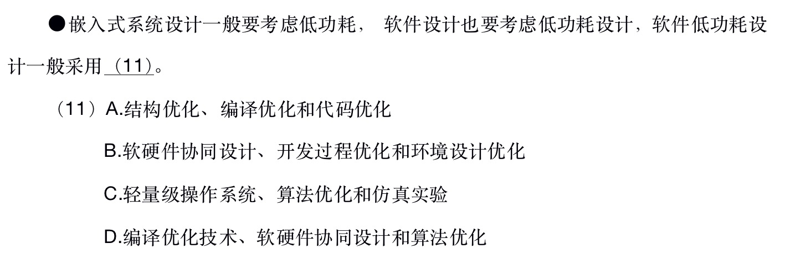

# 计算机基础

## CPU

### CPU 频率

由于CPU与内存之间的存取速度不一致，导致CPU有主频，倍频和外频的概念。其中外频是CPU外部的频率，即与内存通讯的频率，主频即CPU内部的实际运行的频率。倍频=主频/外频。

### CPU 与 DSP

从表面上来看，DSP与标准微处理器有许多共同的地方：一个以ALU为核心的处理器、地址和数据总线、RAM、ROM以及I/O端口，从广义上讲，DSP、微处理器和微控制器（单片机）等都属于处理器，可以说DSP是一种CPU。但DSP和一般的CPU又不同：

- 体系结构

  CPU是冯.诺伊曼结构的，而DSP有分开的代码和数据总线即 “[哈佛结构](https://zh.wikipedia.org/wiki/%E5%93%88%E4%BD%9B%E7%BB%93%E6%9E%84)”。 

## 串行总线和并行总线

串行总线每次传输一个比特数据，并继续进行以上单次过程的通信方式。并行总线一次可以传输多个比特。串行通信被用于长距离通信及大多数计算机网络。

串行通信构架的例子：RS-232、RS-422、通用串行总线、IEEE1394、以太网、SATA、PCI-EXPRESS等。

## 嵌入式系统

嵌入式系统低功耗软件方面的优化主要包括如下几点：

1. 软硬件协同设计，即软件的设计要考虑与硬件的匹配，考虑硬件因素。
2. 编译优化，采用低功耗的编译技术。
3. 减少系统的持续支行时间，从算法角度进行优化。
4. 用“中断”代替“查询”。
5. 进行电源的有效管理。

## CRC 校验码

全称循环冗余校验码(Cyclic redundancy check)。CRC是一种根据网络数据包或计算机文件等数据产生简短固定位数校验码的一种散列函数，主要用来检测或校验数据传输或者保存后可能出现的错误。生成的数字在传输或者存储之前计算出来并且附加到数据后面，然后接收方进行检验确定数据是否发生变化。

### CRC 计算步骤

1. 先选择一个除数，一般用一个多项式表示，生成一个二进制串。
2. 根据步骤1中选择的除数，把位数减去1，得到一个少一位的全是0的数，并把这个数添加到待发送的信息码后面。
3. 把步骤2中的数除步骤1中的数（模2除数），得到一个余数，如果余数位数不足，则前面补0到1中位数减1.这个余数就是CRC校验码。 

## 题目

### 1. 2018下半年架构师

答案：B

解析：DSP有分开的代码和数据部线，即：“哈佛结构”。

答案：B

解析：A中的一般都是全双工不正确。C可以有校验位，但不能纠正。D明显错误。

答案：D

解析：根据嵌入式软件低功耗设计的5点对照，应采用，软硬件协同，编译优化和算法优化。

答案：A

解析：主频=外频*倍频  200M * 12 = 2.6G

答案： B

解析：根据给定的多项式，得到除数为：101011(6位)，得到CRC校验码肯定是5位（6-1），计算时在给定的信息码后面加上5个0，得到 11100011000000，把这个数用模2除法去除除数 101011，得到结果为：11001，刚好5位。所以答案为B。
