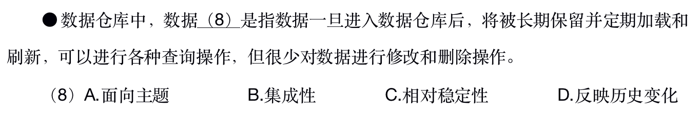

# 商业智能

商业智能（BI）是企业对商业数据的搜集、管理和分析的系统过程，目的是使企业的各级决策者获得知识或洞察力，帮助他们作出对企业更有利的决策。一般认为：**数据仓库**、**联机分析处理（OLAP）** 和 **数据挖掘** 是商业智能的三在组成部分。

## 数据仓库

数据仓库是一个面向主题的，集成的，相对稳定且随时间变化的数据集合。用于支持管理决策。数据仓库的关键特征是：**面向主题**、**集成**、**非易失的**、**时变的**。

### 与传统数据库的比较

| 比较项目 | 传统数据库 | 数据仓库 |
|----|----|----|
| 数据内容 | 当前值 | 历史的、归档的、归纳的、计算的数据（处理过的） |
| 数据目标 | 面向业务操作程序、重复操作 | 面向主体域，分析应用 |
| 数据特性 | 动态变化、更新 | 静态、不能直接更新，只能定时添加、更新 |
| 数据结构 | 高度结构化、复杂，适合操作计算 | 简单、适合分析 |
| 使用频率 | 高 | 低 |
| 数据访问量 | 每个事务一般只访问少量记录 | 每个事务一般访问大量记录 |
| 对响应时间的要求 | 计时单位小，如秒 | 计时单位相对大，除了秒，还有分钟、小时 |

## OLTP 与 OLAP  的比较

OLTP 即联机事务处理，就是我们经常说的关系数据库的基础。
OLAP 即联机分析处理，是数据仓库的核心部分。

## 数据挖掘

数据挖掘是在**没有**明确假设的前提下去挖掘信息、发现知识。数据挖掘所得到的信息应具有先知、有效和可实用三个特征。先前未知的信息是指该信息是预先未曾预料到的，即数据挖掘是要发现那些不能靠直觉发现的信息或知识，甚至是违背直觉的信息和知识，挖掘出的信息越出乎意料，就可能越有价值。

## 题目

### 1. 2018下半年架构师

答案：C

解析：根据题目描述，一旦进入数据仓库，数据长期保留，很少对数据进行更新和删除操作。