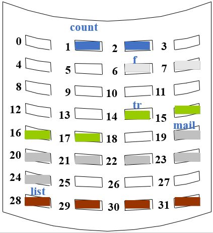
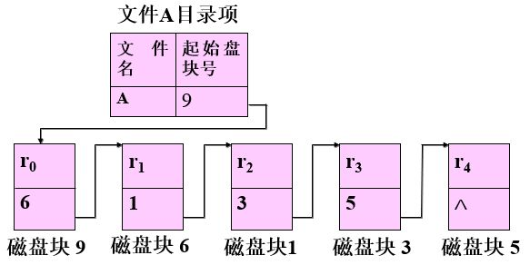
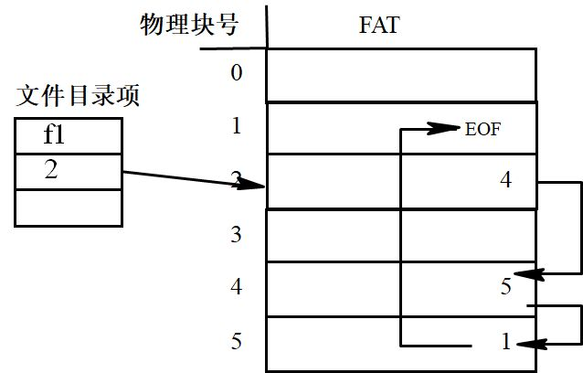
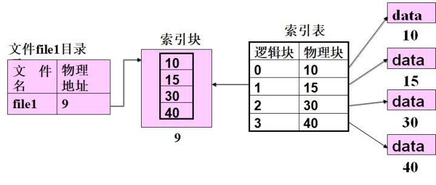
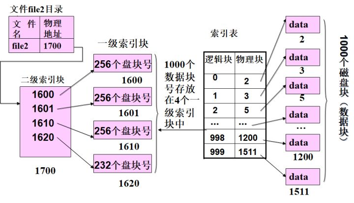
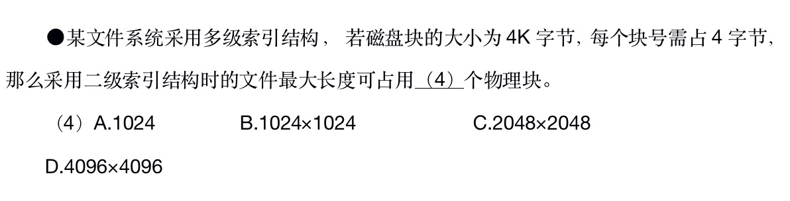

# 文件系统

## 物理结构
物理上存储文件的方式常有以下几种：

### 连续文件
将逻辑文件中的信息顺序存储到连续的物理盘中。

优点
* 顺序访问速度快
* 可随机存取

缺点
* 硬盘空间会产生碎片
* 文件修改困难

### 串联文件

#### 隐式链接
存储文件的物理块通过指针串联起来。就像链表一样。

缺点
* 文件容易丢失
* 文件只能顺序存取

#### 显式链接
所有链接指针统一存放在一张显式的链接表中（FAT文件分配表）。一个逻辑磁盘设置一张表，以物理盘块号为序列，表项内容为指向某文件下一盘块的指针。

评价

* 存储空间利用率高。无磁盘碎版问题。
* 文件创建时不需要指出文件大小。采用指针形式。
* 文件修改，扩充容易。
* 顺序存取效率高，随机存取效率较低。

### 索引文件
文件由数据文件和索引表构成。文件的目录项指向一个索引块，索引块中存放着索引表。索引块可以有多级，一般是两级。

一级索引示意图如下。

二级索引示意图如下。

索引文件既适用于顺序存取，也适用于随机访问。但

## 题目

### 1. 2018下半年架构师

答案：B

解析：采用二级索引方式。一个硬盘块为4K，每个块号4B，所以一个硬盘块可以 1K 索引指针（4K / 4B = 1K）。每一个索引又指向另一个索引块，每个索引块同样也是 1K 索引指针。题目问的是文件最大长度可占用多少物理块，而不是多少容量。

