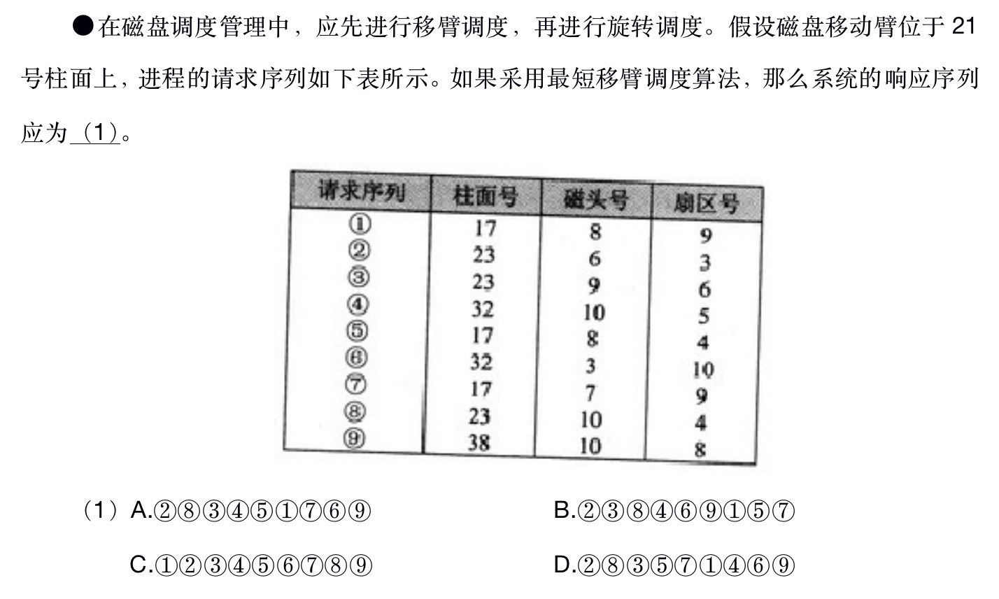

# 磁盘移臂调度算法

## 概念

共有 4 种。

1. 先来先服务
   根据访问者提出访问请求的先后次序来决定执行次序。

2. 最短寻找时间优先调度算法
   从等待的访问者中挑选寻找时间最短的那个请求执行，而不管访问者的先后次序。

3. 电梯调度算法
   从移动臂当前位置沿移动方向选择最近的那个柱面的访问者来执行，若该方向上无请求访问时，就改变移动方向再选择。

4. 单向扫描调度算法
   从 **0** 柱面开始往里单向扫描，扫到哪个执行哪个。

## 题目

### 1. 2018 下半年架构师

答案：D

解析： 要求使用最短移臂调度算法。即算法 2.如果扇区号相同，则要求先移臂再旋转。主要关注柱面号和扇区号，磁头号不影响调度。根据移臂最短原则，系统响应序列如下：
2(最近) -› 8(离 21 最近，并且扇区号也最近) -> 3(都是 23) -> 5(3 个同为 17 中，扇区号是最近) ...
