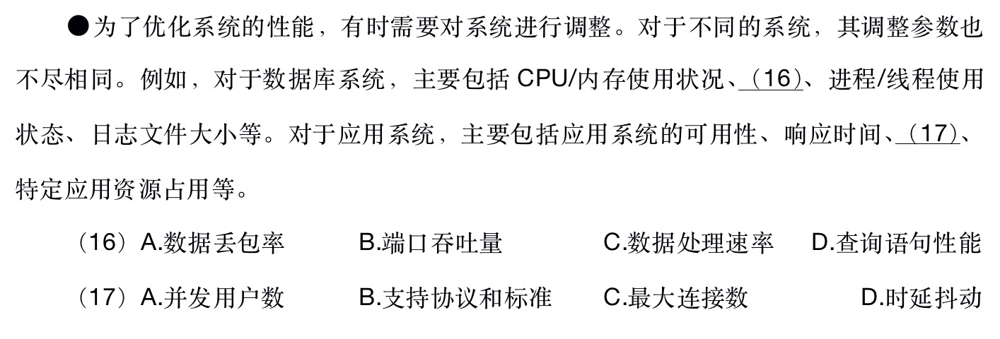

# 操作系统

## 系统性能

### 网络设备类性能指标
吞吐量，延迟，丢包率，转发速度。

### 网络类性能指标
可达性，网络系统的吞吐量，传输速度，信道利用率，信道容量，带宽利用率，丢包率，平均传输延迟，平均延迟抖动，延迟/吞吐量的关系。

### 操作系统性能指标
系统的可靠性，系统的吞吐量，系统响应时间，系统资源利用率，可移植性。

## 题目

### 1. 2018下半年架构师

答案：D，A

解析： 数据库系统指标，答案中前3个都是网络设备相关的。所以选D。应用系统的性能指标，后3个也是网络相关的，所以选A。