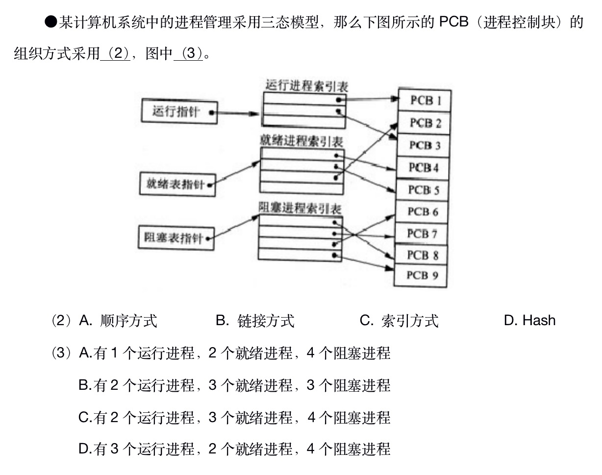

# 进程控制块

## 概念

进程控制块(PCB)是系统为了管理进程设置的一个专门的数据结构。系统用它来记录进程的外部特征，描述进程的运动变化过程。同时，系统可以利用PCB来控制和管理进程，所以说，PCB（进程控制块）是系统感知进程存在的唯一标志。

进程控制块常记录如下信息：

* 进程状态：可以是new、ready、running、waiting或 blocked等。
* 程序计数器：接着要运行的指令地址。
* CPU寄存器：如累加器、变址寄存器、堆栈指针以及一般用途寄存器、状况代码等，主要用途在于中断时暂时存储数据，以便稍后继续利用；其数量及类别因计算机体系结构有所差异。
* CPU排班法：优先级、排班队列等指针以及其他参数。
* 存储器管理：如标签页表等。
* 会计信息：如CPU与实际时间之使用数量、时限、账号、工作或进程号码。
* 输入输出状态：配置进程使用I/O设备，如磁带机。

## 组织方式

进程控制块PCB的组织方式
1. 线性表方式：不论进程的状态如何，将所有的PCB连续地存放在内存的系统区。这种方式适用于系统中进程数目不多的情况。
2. 索引表方式：该方式是线性表方式的改进，系统按照进程的状态分别建立就绪索引表、阻塞索引表等。
3. 链接表方式：系统按照进程的状态将进程的PCB组成队列，从而形成就绪队列、阻塞队列、运行队列等。

## 题目

### 1. 2018下半年架构师

答案： C，C

解析： 图中有专门的索引表，所以组织方式明显为“索引方式”。根据索引表中的数量统计，分别是2，3，4个运行，就绪和阻塞状态的进程。