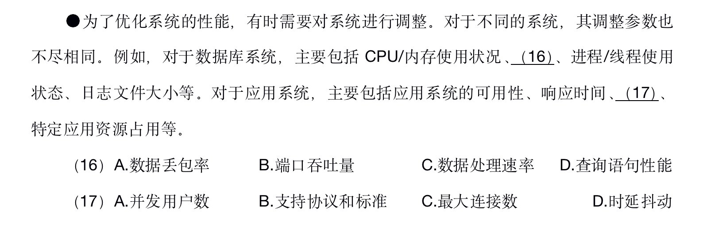
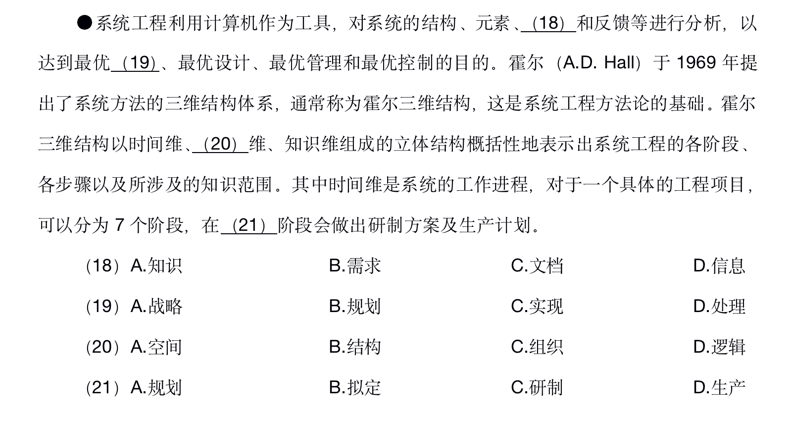

# 其它知识点

## 系统性能优化

## 题目
### 1. 2018年系统架构师

答案：D,A
优化系统性能。对于数据库系统，主要包括CPU/内在使用状况、查询语句性能、进行/线程使用状态、日志文件大小等。对于应用系统，主要包括应用系统的可用性、响应时间、并发用户数、特定应用资源占用等。

## 系统工程

系统工程是从整体出发合理开发、设计、实施和运用系统系统科学的工程技术。它根据总体协调的需要，综合应用自然科学和社会科学中有关的思想、理论和方法，利用计算机作为工具，对系统的结构、元素、信息、和反馈等进行分析，以达到最优规划、最优设计、最优管理和最优控制的目的。

### 霍尔三维结构（霍尔的系统工程，硬系统方法论）

霍尔三维结构是将系统工程整个活动过程分为前后紧密衔接的七个阶段和七个步骤，同时还考虑了为完成这些阶段和步骤所需要的各种专业知识和技能。形成了时间维、逻辑维和知识维所组成的三维空间结构。
时间维：表示系统工程活动从开始到结束按时间顺序排列的全过程，分为规划、拟定方案、研制、生产、安装、运行、更新七个时间阶段。
逻辑维：指时间维的每一个阶段内所要进行的工作内容和应用遵循的思维程序，包括：明确问题、确定目标、系统综合、系统分析、优化、决策、实施七个逻辑步骤。
知识维：列举需要运行包括：工程、医学、建筑、商业、法律、管理、社会科学、艺术等各种知识和技能。
时间维度的七个阶段：
1. 规划阶段，即调研、程序设计阶段，目的在于谋求活动的规划与战略。
2. 拟定方案，提出具体的计划方案。
3. 研制阶段，提出研制方案及生产计划。
4. 生产阶段，生产出系统的零部件及整个系统，并提示安装计划。
5. 安装阶段，将系统安装完毕，并完成系统的运行计划。
6. 运行阶段，系统按照预期的用途开展服务。
7. 更新阶段，即为了提高系统功能，取消旧系统而代之以新系统，或改进原有系统，使之更加有效地工作。

## 题目
### 2018年系统架构师

答案：D,B,D,C
