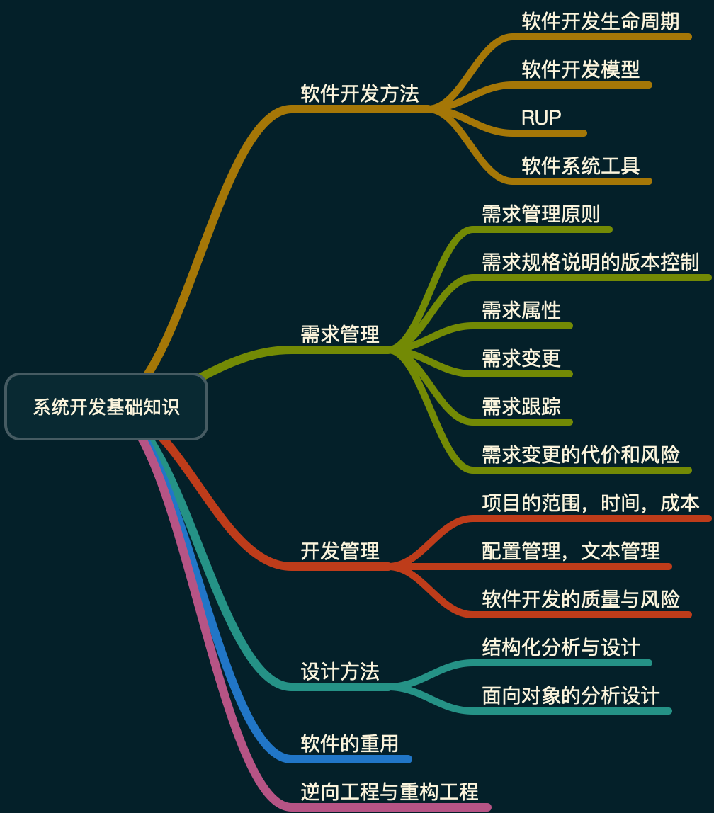

# 系统开发基础知识

## 知识点

## 软件开发方法

### 软件开发模型

1. 瀑布模型，严格按照软件生命周期的各阶段顺序执行，有利于人员的组织管理，但用户不能清晰定义及描述其需求，初始版本的呈现周期较长。
2. 原型模型，提前通过可视化的方式呈现需求。
3. 螺旋模型，快速原型的基础上扩展的，支持大型软件开发，适用于面向规格说明，面向过程和面向对象的软件开发方法，通常将软件开发切割为多个周期，每个周期由4个阶段组成：
   * 目标设定
   * 风险分析
   * 开发和有效性难
   * 评审
4. 基于四代技术的模型，只侧重于支持软件的设计和实现阶段，并不支持全过程。

## 需求管理
需求管理的主要活动：变更控制，版本控制，需求跟踪，需求状态跟踪。
需求变更控制委员会可以由一个小组担任，也可以由多个不同的组担任，负责做出决定，究竟将哪一些已建设需求变更或新产品特征付诸应用。控制需求变更与项目的其他配置管理决策有着密切的联系。变更控制过程中可以使用相应的自动辅助工具。变更的过程中，允许拒绝变更。

### 需求变更
为严格控制软件项目，变更需要确保：

1. 评估已提出的变更。
2. 变更应及时通知所有人。
3. 适当的人选评估和决策变更。
4. 需求变更需要遵循一定程序。

## 开发管理

### 项目的范围，时间，成本

1. 项目的范围定义的输入包括：项目章程，项目范围管理计划，组织过程资产，批准的变更申请。
2. 时间管理的过程包括：活动定义（WBS），活动排序，活动资源估算，活动历时估算，制定进度计划及进度控制。
3. 成本管理活动包括：成本估算，成本预算（基线），成本控制。

### 配置管理，文档管理
1. 产品配置是指一个产品在其生命周期各个阶段所产生的各种形式和各种版本的文档，计算机程序，部件及数据的集合，构成集合的元素称为配置项。
2. 配置项的分类
3. 配置项的属性：名称，标识符，文件状态，版本，作者和日期。
4. 文档分类
   * 用户文档：包括功能描述，安装文档，使用手册，参考手册，操作员指南。
   * 系统文档：与系统实现有关的文档。

文档是影响软件可维护性的决定因素。软件系统的文档可分为用户文档和系统文档两类。

## 集成机制
对工具的集成及用户软件的开发，维护及管理提供统一的支持。按功能可划分为：

1. 环境信息库：是软件开发环境的核心，用以储存与系统开发有关的信息并支持信息的交流与共享。库中储存两类信息，一类是开发过程中产生的有关被开发系统的信息，如分析文档，设计文档，测试报告等。另一类是环境提供的支持信息，如文档模板，系统配置，过程模型，可复用构件等。
2. 过程控制和消息服务器：是实现过程集成及控制集成的基础。
3. 环境用户界面：包括环境总界面和由它实行统一控制的各环境部件及工具的界面。

## 软件的重用
软件重用是使用已有的软件产品（如设计、代码和文档等）来开发新的软件系统的过程。
分类包括：

1. 横向（水平）重用，不同应用领域中的软件元素。如：标准函数库。
2. 纵向（垂直）重用，共性应用领域间的软件构件。

## 题目
### 1. 2018下半年架构师

答案：B

解析： 见上面描述。

答案：A

解析：系统设计属于系统文档。

答案：A

解析：文档管理属于开发管理，不属于需求管理。

答案：A

解析：根据需求变更的相关知识。A中指出只可以由一个小组担任不正确。因为需求变更指出要适当的人选评估和决策变更，不同的需求变更类型，应该由不同的小组担任控制委员会。

答案：A

解析： 根据题目由原型开发阶段和目标软件开发阶段构成，明显是原型模型。

答案： A，C

解析：基于构件，快速开发，其它3个都不对，所以选A。开发流程分成多个阶段，每个阶段都由目标设定，风险分析，开发和有效性验证与评审。属于螺旋模型。所以选C。

答案：B，C

解析：环境信息库用于存储与系统开发有关的信息。过程控制与消息服务器是实现过程集成的控制集成的基础。

答案：B

解析： 水平重用是不同应用领域间的软件元素。典型的如：标准函数库。

答案：C

答案： B, A, D