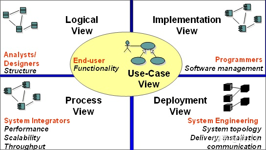

# 4+1视图

## 用户视图（场景视图）

4+1中的1，其它4个视图以用例视图为核心。
用例视力是一种需求分析技术，通常用UML的用例图进行设计。通过用例视图的设计过程，可以正确的识别系统的用户和其它系统（Actor）、系统边界和用例，并对系统的功能场景进行充分的分析，以确定系统提供的功能可以满足用户需求。

* 系统边界：有了边界，才能确定系统的设计范围。同时，通过边界能够识别出系统需要与用户或其它系统进行交互。
* 系统用户：明确的用户定义是系统需求分析的先决条件。
* 功能和场景：通过识别出系统与用户或其它系统的交互，可以分析出系统需要提供哪些功能，以及这些功能存在哪些应用场景。

## 逻辑视图
主要是整个系统的抽象结构表述，关注系统提供最终用户的功能，不涉及具体的编译输出和部署，通常在UML中用类图、交互图、时序图来表述。

## 开发视图
主要包括两部分信息：
* 逻辑架构元素，描述其代码位置，可以是代码仓位置，或代码目录，或是开源软件的版本信息等。
* 系统的构建，即如何将代码编译成二进制交付件。

## 过程视图
用来描述系统中的动态信息，常用UML中的序列图。过程视图的设计，最常见的是逻辑构架元素之间的交互关系，比如消息交互、服务调用或API调用。

## 物理视图（部署视图）
部署视图就是对这个部署信息进行描述，包括：
* 二进制交付件，与软件环境的部署关系
* 软件环境与物理环境的部署关系
