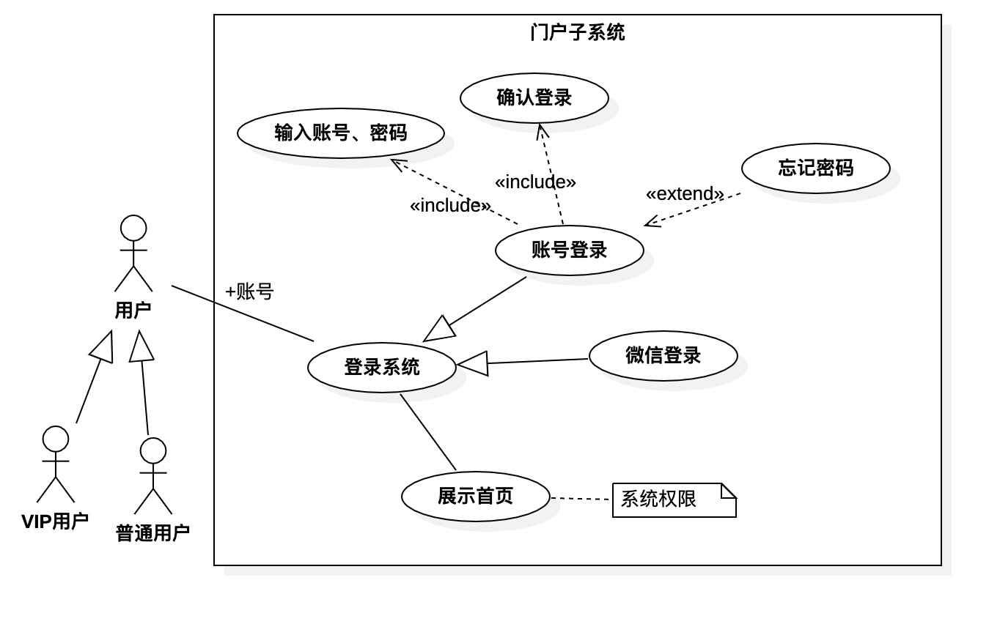
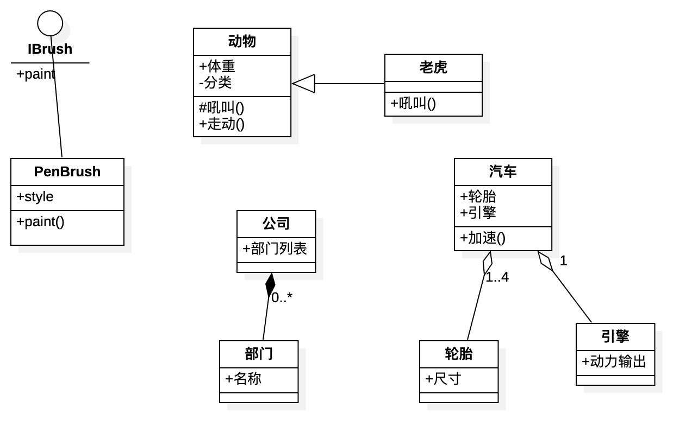

# UML（统一建模语言）

## UML 图形分类

## UML模型

UML系统开发中有三个主要的模型
* 功能模型：从用户的角度展示系统的功能，包括用例图。
* 对象模型：采用对象，属性，操作，关联等概念展示系统的结构和基础，包括类别图、对象图。
* 动态模型：展现系统的内部行为。包括序列图，活动图，状态图。

## 用例图

用例图主要回答两个问题：1，是谁用软件。2，软件的功能。从用户的角度描述了系统的功能，并指出各个功能的执行者，强调用户的使用者，系统为执行者完成哪些功能。

## 类图

用户根据用例图抽象成类，描述类的内部结构和类与类之间的关系，是一种静态结构图。在UML类图中，常见的有以下几种关系：泛化，实现，关联，聚合，组合，依赖。

### 泛化
是一种继承关系，表示一般与特殊的关系，它指定了子类如何继承父类的所有特征和行为。

### 实现
实现是一种类与接口的关系，表示类是接口所有特征和行为的实现。

### 关联
关联是一种拥有关系，它使一个类知道另一个类的属性和方法。关联可以单向也可以双向的。在代码中的体现就是成员变量。

### 聚合
聚合是整体与部分的关系，且部分可以离开整体而单独存在。如车与轮胎是整体和部分的关系。聚合关系是关联关系的一种，是强的关联关系。在代码中的体现是成员变化。

### 组合
组合是整体也部分的道经，但部分不能离开整体而单独存在。如公司和部门是整体和部分的关系，没有公司就不存在部门。组合关系是关联关系的一种，是比聚合关系还要强的关系，它要求普通的聚合关系中代表整体的对象负责代表部分的对象的生命周期。

### 依赖
是一种使用关系，即一个类的实现需要另一个类的协助，所以要尽量不使用双向的互相依赖。如局部变量、方法的参数或才对静态方法的调用。用带箭头的虚线，指向被使用者。

## 对象图
描述的是参与交互的各个对象在交互过程中某一时刻的状态。对象图可以被看作是类图在某一时刻的实例。

## 状态图
是一种由状态、变迁、事件和活动组成的状态机，用来描述类的对象所有可能的状态以及时间发生时状态的转移条件。

## 活动图
是状态图的一种特殊情况，这些状态大都处于活动状态。本质是一种流程图，它描述了活动到活动的控制流。
交互图强调的是对象到对象的控制流，而活动图则强调的是从活动到活动的控制流。
活动图是一种表述业务过程以及工作流的技术。它可以用来对业务过程，工作流建模，也可以对用例实现甚至是程序实现来建模。

## 序列图-时序图
交互图的一种，描述了对象之间消息发送的先后顺序，强调时间顺序。
序列图的主要用途是把用例表达的需求，转化为进一步，更加正式层次的精细表达。用例常常被细化为一个或者更多的序列图。同时序列图更有效地描述如何分配各个类的职责以及各类具有相应职责的原因。

## 协作图
交互图的一种，描述了收发消息的对象的组织关系，强调对象之间的合作关系。时序图按照时间顺序布图，而写作图按照空间结构布图。

## 构件图
构件图是用来表示系统中构件与构件之间，类或接口与构件之间的关系图。其中，构建图之间的关系表现凛依赖关系，定义的类或接口与类之间的关系表现为依赖关系或实现关系。

## 部署图
描述了系统运行时进行处理的结点以及结点上活动的构件的配置。强调了物理设备以及之间的连接关系。