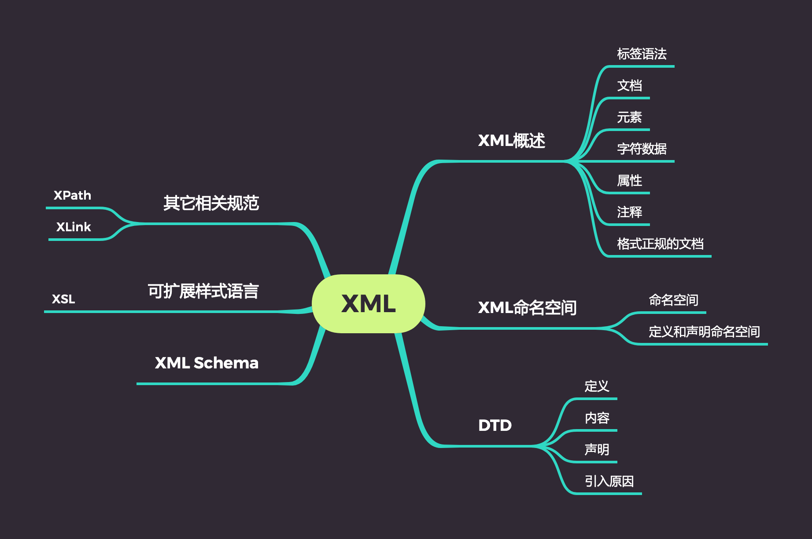

# XML

## 知识点

## XML 概述

可扩展标记语言（XML）是标准通用标记语言（SGML）的一个子集。可以用 XML 来开发一种标记语言，它的元素和属性多是为专门行业和产业而定义的。

### XML 的特点和功能

- XML 允许各种各样的文档显示类型
- XML 支持但并不需要 DTD，XML 的支持标准（XPath，XPointer）比 HTML 更为复杂。
- XML 标准支持打印文档和电子文档以及其他的为不同用户定义了不同内容的外观的文档。
- XML 支持客户端或服务器计算机上的进程，这就允许开发人员分配资源和随时地节省资源。

## XML 命名空间

XML 命名空间是解决多个义性和名字冲突问题的方案。是一组具有结构的名称的集合。

推荐标准为我们提供了 xmlns 属性，属性值就是 URI。

## DTD

文档类型定义。包含：元素声明，实体定义，属性的各类。

引入原因:

1. 提供一种验证手段
2. 实现了文件格式的统一化，提高了文件的重用性。
3. 使用 DTD 进行验证，增加了操作时间。

声明：

DTD 声明：内部 &lt;!DOCTYPE 根元素名称 [DTD 规则]>

属性声明: <ATTLIST 元素名称 属性名称 属性默认址>

实体声明：<!Entity 实体名称 实体内容>

元素的声明：&lt;!ELEMENT 元素名称 元素定义>

## 可扩展样式表语言

XSL 由两大部分组成：

1. 第一部分描述了如何将 XML 文档转换为可浏览或可输出的格式。
2. 第二部分定义了格式无明（FO），源树转换为可以显示的结果树，称为树转换，这个过程称为格式化。

XSL 即可以在服务端转换也可以在客户端转换。

## 其他相关规范

### XPath

用于在 XML 文档结构中进行导航。由两部分组成：一部分为表达式语法。另一部分是一组名为 XPath 核心库的基本函数。

### XLink

指定一个文档如何连接到另一个文档。

### XPointer

指定文档内部的位置。
